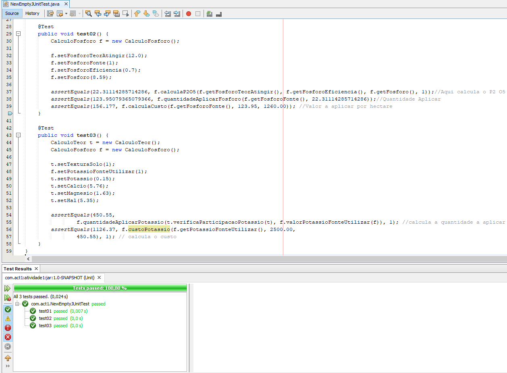

# Activity1-Soil_Correction
<h2 align="center">RELATÓRIO DO CÓDIGO FEITO POR CAIO IWAMOTO</h2>
<h3>Dificuldades Encontradas:</h3>
<li>Nomenclatura de classes e códigos (dificultando saber qual classe fazia qual cálculo)</li>
<li>Uso de muitas estruturas condicionais</li>
<li>Métodos com atributos aleatórios (no qual não eram utilizados)</li>
<li>Muitos problemas da planilha levado para o código</li>
<h3>Possíveis correções:</h3>
<li>Uso de Enum para dizer quais são as Fontes de Potassio e Fosforo (facilitando a manutenabilidade e interpretação do código)</li>
<li>Renomeações de variáveis para melhor entendimento</li>

<h3>O que foi preciso alterar para utilização dos testes mantendo a arquitetura do código:</h3>
<li>Alterações no método que calcula o P2O5 (no código, o método estava com nome que realizava a função da quantidade a aplicar no solo)</li>
<li>Correção no cálculo de Custo a aplicar de Fonte de Fósforo (as variáveis estavam invertidas, fazendo o cálculo ficar errado)</li>

<h3 align = "center">Consegui realizar os testes, obtendo 100% conforme captura abaixo</h3>

  

<h3>O que não vi no código:</h3>
<li>Calculo de Nutriente que cada Fonte de Fosforo e Potassio fornecem ao Solo em sua correção</li>
